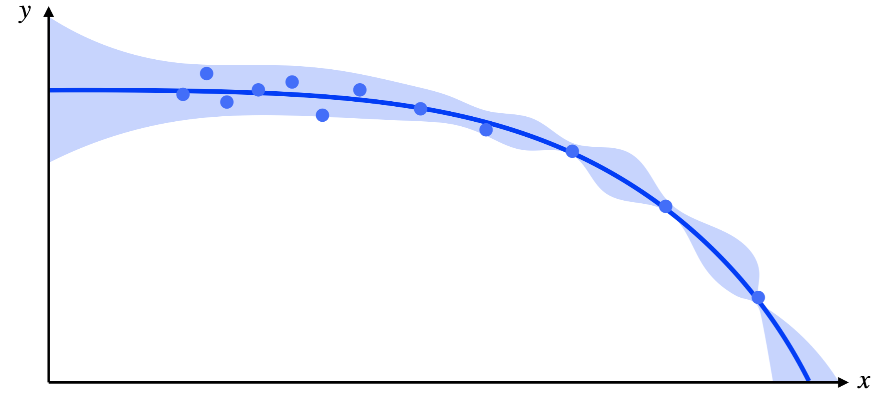
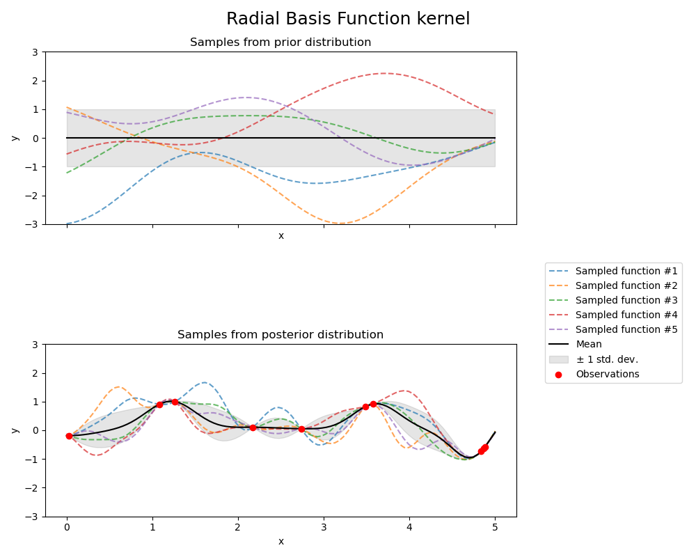

Automated Data Superposition
============================

Most methods for automated superposition of discrete data sets have two main components.
First, they define a continuous interpolant for the data. Then, they define and minimize
an objective function based on these interpolants.

The method used in this package (outlined `here <https://arxiv.org/abs/2204.09521>`_)
uses Gaussian process regression to build statistical interpolants (that come with mean
and variance estimates). The objective is the negative logarithm of the posterior
probability that one data set is observed from the interpolant for another data set.
Therefore, this method is an application of maximum *a posteriori* estimation.

Gaussian Process Regression
---------------------------

`Gaussian Process Regression (GPR) <https://scikit-learn.org/stable/modules/gaussian_process.html>`_
is a machine learning method for building a continuous model of a data set. GPR treats each data
point in a data set as observations :math:`y` of (not necessarily independent) random variables. These
random variables may be concatenated to form a random vector, or a stochastic process parameterized
by the independent coordinate :math:`x`. If each random variable is assumed to follow a Gaussian
distribution, then we call this a Gaussian Process:

.. math::
   y(x) \sim GP(\mu(x), K(x,x';\theta))

The Gaussian Process model is defined by a mean function :math:`\mu(x)`, which is usually assumed to
be zero, and a covariance kernel `K(x,x';\theta)`, which defines the pointwise variance at :math:`x`
and pairwise covariance between :math:`x` and :math:`x'`. We typically choose a form of the covariance 
kernel that encodes prior  expectations about the data, such as some degree of smoothness, scale, 
or uncorrelated variance. The default kernel in this package is:

.. math::
   K(x,x';\theta) = A\left(1 + \frac{(x - x')^2}{2\alpha l^2}\right)^{-\alpha} + B + \sigma^2\delta_{x,x'}

where the set of parameters :math:`\theta = [A, \alpha, l, B, \sigma]` are called *hyperparameters*.
The values of these hyperparameters are determined by maximizing the marginal log-likelihood of the data
given the covariance kernel, with some prior specified over the hyperparameters.

Once the covariance kernel is set and hyperparameters are optimized, the *posterior* mean :math:`m(x)` 
and variance :math:`s^2(x)` of the Gaussian Process model are fixed:

.. math::
   m(x^*) = \underline{K}(x^*,\underline{x})\mathbf{K}^{-1}\underline{y}

.. math::
   s^2(x^*) = K(x^*,x^*;\theta) - \underline{K}(x^*,\underline{x})\mathbf{K}^{-1}\mathbf{K}^T

where :math:`x^*` is an arbitrary coordinate of interest, :math:`\underline{K}(x^*,\underline{x})` is
a vector obtained by evaluating the :math:`K(x^*,x';\theta)` with :math:`x'` taking on each value
present in the data set, :math:`\mathbf{K}` is a matrix obtained by evaluating :math:`K(x,x';\theta)`
with both :math:`x` and :math:`x'` taking on each value present in the data set, and :math:`\underline{y}`
is a vector consisting of each value of :math:`y` present in the data set.

A trained Gaussian Process model predicts a smooth interpolant with uncertainty bounds, which looks
qualitatively like the example presented below.

It is typical for GPR to be explained abstractly as specifying a *prior distribution* of functions that
could represent a data set, and applying the data set to obtained the *posterior distribution* of functions
drawn from that prior that are most likely to fit the data. For instance, the prior and posterior for
a Radial Basis Function kernel (the first term in our kernel) with an example data set are presented
below (taken from `sklearn <https://scikit-learn.org/stable/modules/gaussian_process.html>`_).

Maximum A Posteriori Estimation
-------------------------------

Consider the problem of shifting a single data point :math:`(x_i,y_i)` by a horizontal scale factor :math:`a` 
and a vertical shift factor :math:`b`. Say that this data point belongs to a data set at state :math:`j`,
and we'd like to choose :math:`a` and :math:`b` so that this data point overlaps with a GP model from state 
:math:`k`. We begin by assuming that this shifted data point is an observation from the GP:

.. math::
   b y_i \sim N(m_k(a x_i), s^2_k(a x_i))

The *negative log-likelihood (NLL)* of this observation is:

.. math::
   -\ln p(x_i, y_i | a, b) = \frac{1}{2}\left(\frac{b y_i - m_k(a x_i)}{s_k(a x_i)}\right)^2 + \ln s_k(a x_i) + \ln \sqrt{2\pi}

Now, consider generalizing this task to an entire data set :math:`\mathcal{D}_j = \{(x_i, y_i)\}`. The NLL for
this entire set is the sum of the NLLs of the individual data points:

.. math::
   -\ln p(\mathcal{D}_j | a, b) = \sum_{(x_i, y_i) \in \mathcal{D}_j} - \ln p(x_i, y_i | a, b)

Finally, to obtain the *posterior* probability of certain shift factors given the data, we apply Bayes'
theorem:

.. math::
   p(a, b | \mathcal{D}_j) \propto p(\mathcal{D}_j | a, b) p(a, b)

with a suitable choice of the *prior* over the shift factors, :math:`p(a,b)`. We typically employ either
a uniform prior or a Gaussian prior, though others may be implemented within this package.

The maximum *a posteriori* estimate for the shift factors is that which minimizes the negative logarithm
of the posterior:

.. math::
   \{\hat{a}, \hat{b}\} = \underset{a, b}{\mathrm{arg}\min} [-\ln p(a, b | \mathcal{D}_j)]

By repeating this estimation for each consecutive pair of data sets, we may construct the master curve.

