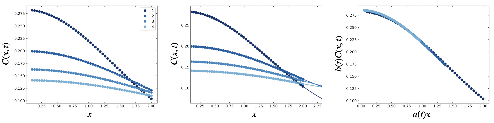
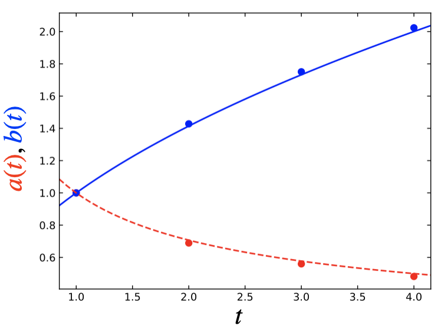

Tutorial: Creating a Master Curve
=================================

This tutorial will explore the fundamentals of using the ``mastercurves`` package to create a
master curve from synthetic data describing the one-dimensional diffusion of an instantaneous
point source. The tutorial is based on the example in the introduction from `A Data-Driven Method
for Automated Data Superposition with Applications in Soft Matter Science <https://arxiv.org/abs/2205.09521>`_,
and on `this issue in the package repository <https://github.com/krlennon/mastercurves/issues/1>`_.

Import Packages
---------------

Using the ``mastercurvse`` package will always require importing ``numpy`` and ``matplotlib.pyplot``.
It also requires importing the ``mastercurves`` package itself or some modules from the package. We'll
import the essential modules for this tutorial: ``mastercurves.MasterCurve`` and
``mastercurve.transforms.Multiply``.

.. code-block:: python

   import numpy as np
   import matplotlib.pyplot as plt
   from mastercurves import MasterCurve
   from mastercurves.transforms import Multiply

Creating Synthetic Data
-----------------------

Now, let's generate some synthetic data from the diffusion equation. We'll ultimately work with the
logarithm of this data, so let's first define an array of positive :math:`x` coordinates:

.. code-block:: python

   x = np.linspace(0.1,2)

We'll also sample from a few positive values of the time:

.. code-block:: python

   t_states = [1, 2, 3, 4]

We also need a function to compute the concentration at different :math:`(x,t)` from the diffusion equation:

.. code-block:: python

   diffusion_eq = lambda x, t, M, D : (M/np.sqrt(4*np.pi*D*t))*np.exp(-(x**2)/(4*D*t))

Now, we can create our synthetic data. We'll just assume that :math:`M = 1` and :math:`D = 1` in dimensionless
units for now:

.. code-block:: python

   x_data = [x for t in t_states]
   c_data = [diffusion_eq(x, t, 1, 1) for t in t_states]

Lastly, we'll take the logarithm of our data. The ``mastercurves`` package can work with the raw data itself
for certain cases, but performance is much better (and the package is more flexible) when working with the
logarithm of data that will be shifted by ``Multiply`` transforms (check out the `Method section of the
associated paper <https://arxiv.org/abs/2204.09521>`_ to learn why). So, we should almost always take the
logarithm of the data before developing the master curve.

.. code-block:: python

   x_data = [np.log(xi) for xi in x_data]
   c_data = [np.log(ci) for ci in c_data]

Creating the Master Curve
-------------------------

We're now ready to create a master curve and superpose the data. The first step is to initialize a ``MasterCurve``
object. Because our synthetic data is noiseless, we'll create a ``MasterCurve`` with no fixed noise:

.. code-block:: python

   mc = MasterCurve(fixed_noise = 0)

The next step is to add the data to the ``MasterCurve``:

.. code-block:: python

   mc.add_data(x_data, c_data, t_states)

In the diffusion equation, there is both a dynamic concentration scale and a dynamic length scale. This means
that we'll need to shift both the horizontal and vertical axes by a time-dependent multiplicative shift factor
to superpose the data. We can add these ``Multiply`` transforms (note that we could pass the argument
``scale="log"`` to these transforms to indicate that we're working with the logarithm of our data, but this
is not necessary since ``"log"`` is the default scale):

.. code-block:: python

   mc.add_htransform(Multiply())
   mc.add_vtransform(Multiply())

Finally, we'll superpose the data using these transforms:

.. code-block:: python

   mc.superpose()

Plotting the Master Curve
-------------------------

We can use the built-in ``plot`` method to graphically display the data, Gaussian process fits, and
master curve:

.. code-block:: python

   fig1, ax1, fig2, ax2, fig3, ax3 = mc.plot(colormap = lambda i: plt.cm.Blues_r(i/1.5))

We've passed a ``colormap`` argument to this method to define a custom colormap to more closely match
the figures in the `paper <https://arxiv.org/abs/2204.09521>`_. The value of this argument can be any
colormap from ``matplotlib.pyplot.cm``.

By default, the ``plot`` method will display the data on a logarithmic scale. Here, we'll adjust to a
linear scale to more closely mimic the figures in the `paper <https://arxiv.org/abs/2204.09521>`_ (using
the ``ax.set_xscale`` and ``ax.set_yscale`` methods). You can see the results below, which show the
raw data (left), data with Gaussian process fits (center), and master curve (right).

Analyzing the Shift Factors
---------------------------

An important feature of the ``mastercurves`` package is that we may analyze the shift factors used to
superpose the data. These shift factors are stored as attributes of the ``MasterCurve`` object. We can
grab them directly from the object:

.. code-block:: python

   a = mc.hparams[0]
   b = mc.vparams[0]

Note that we take the zeroth (0) element of the ``hparams`` and ``vparams`` attributes. This is because
these attributes store the shift factors for each transformation added to the ``MasterCurve``, and there
may be more than one transformation. These shift factors are stores as a list, with each element containing
the inferred shift parameters for each transform. We only have one horizontal and one vertical transform
here, so ``mc.hparams`` and ``mc.vparams`` each have only one element. For ``mc.hparams``, that element is 
the list of horizontal shift factors for each state (or the vertical shift factors for ``mc.vparams``).

We can plot these shift factors against the state coordinate, :math:`t`:

.. code-block:: python

   fig, ax = plt.subplots(1,1)
   ax.plot(t_states, a, 'ro')
   ax.plot(t_states, b, 'bo')

Based on the diffusion equation, we expect that these shift factors should follow specific trends with
:math:`t`, namely that they should vary with the inverse square root and square root of time, respectively.
We'll check this by plotting those relationships:

.. code-block:: python
   xlim = ax.get_xlim()
   xv = np.linspace(xlim[0], xlim[1])
   ax.plot(xv, np.sqrt(xv), 'b-')
   ax.plot(xv, 1/np.sqrt(xv), 'r--')

As we see from the plot below, the inferred shift factors indeed closely match the expected behavior!

