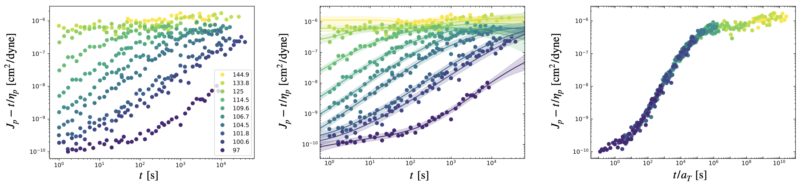
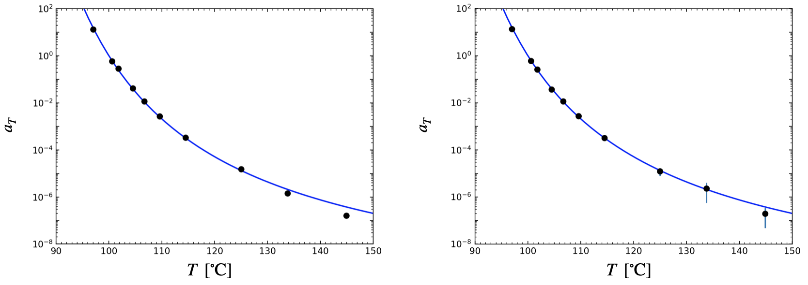

Sensitivity to Noisy Data
=========================

Here, we'll build on the previous demo (`Time-Temperature Superposition <https://krlennon-mastercurves.readthedocs.io/en/latest/tts_demo.html>`_) to investigate the sensitivity of the method to noise in the data.

This demo uses creep compliance data digitized from `Plazek (1965) <https://pubs.acs.org/doi/10.1021/j100894a039>`_.
The data is pre-processed to account for changes in compliance scale, so only horizontal shifting by a scale
factor is required to superpose the data sets taken at different temperatures.

Adding Noise to Data
--------------------

Most of the code needed to run this example is the same as for the `TTS <https://krlennon-mastercurves.readthedocs.io/en/latest/tts_demo.html>`_ demo. We'll slightly modify how we pre-processs the data, by adding Gaussian White Noise. We'll set this up by choosing a relative noise level (ratio of the noise to the signal), and seeding the random number generator (so that we all get the same result):

.. code-block:: python

   noise = 0.2
   np.random.seed(3)

Next, we'll add some synthetic noise to the creep compliance, and take the logarithm as before:

.. code-block:: python

   for k in range(len(T)):
       ts[k] = np.log(np.array(ts[k]))
       Js[k] = np.log(np.array(Js[k])*(1 + noise*np.random.randn(len(Js[k]))))

Creating and Plotting the Master Curve
--------------------------------------

The steps needed to create the master curve and superpose the data are the same as before:

.. code-block:: python

   # Build a master curve
   mc = MasterCurve()
   mc.add_data(ts, Js, T)

   # Add transformations
   mc.add_htransform(Multiply())

   # Superpose
   mc.superpose()

Plotting the master curve is also the same as before. We'll change the reference state,
plot, and then beautify the plots (shown in the previous demo, but not here):

.. code-block:: python

   a = mc.hparams[0]
   mc.change_ref(97)
   mc.change_ref(100, a_ref=10**(1.13))
   figs_and_axes = mc.plot(log=True, colormap=plt.cm.viridis_r)

The results are shown below!

Comparing Shift Factors
-----------------------

Let's see how the added noise has affected the shift factors. First, we'll obtain the
uncertainties in the shift factors:

.. code-block:: python

   da = mc.huncertainties[0]

and use these to plot error bars on the shift factors vs. temperature:

.. code-block:: python

   fig, ax = plt.subplots(1,1)
   ax.errorbar(np.array(T), a, yerr=da, ls='none', marker='o', mfc='k', mec='k')

We can also compare the shift factors to the WLF equation with coefficients found
by Plazek for this data set:

.. code-block:: python

   Tv = np.linspace(90,150)
   ax.semilogy(Tv, 10**(-10.7*(Tv - 100)/(29.9 + Tv - 100)), 'b')
   plt.show()

The shift factors agree with the WLF equation very closely. We also see that the
shift factors for data with no added noise (left) are very lose to those with added
noise (right). The noise doesn't substantially affect the performance of the method,
but is instead directly transduced to larger uncertainties in the shift factors
(as seen in the larger error bars in the plot on the right).

