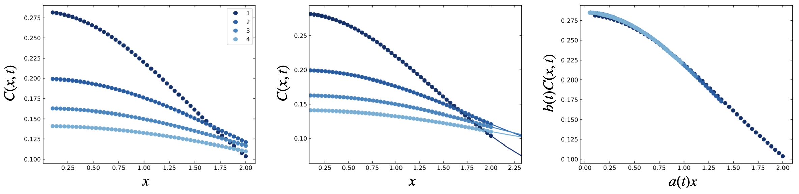

Tutorial: Adjusting the Gaussian Process Kernel
===============================================

This tutorial will outline the steps for changing the covariance kernel used in the Gaussian process
fits to data, and for changing bounds on the kernel hyperparameters. We'll use the `previous tutorial
on the diffusion equation <https://krlennon-mastercurves.readthedocs.io/en/latest/diffusion.html>`_ as
a base, and make a few modifications to show how to change the kernel.

Changing the Gaussian Process Kernel
------------------------------------

``mastercurves`` provides a method, ``mastercurves.MasterCurve.set_gp_kernel``, which allows the user
to manually adjust the Gaussian process kernel if they believe that the default kernel is insufficient
for a particular data set. The first step in changing the kernel is to import the desired kernels from
``scikit-learn``. See the `documentation <https://scikit-learn.org/stable/modules/gaussian_process.html>`_
for ``scikit-learn`` for a list of supported kernels.

Here, we'll consider a simple modification to the previous `tutorial <https://krlennon-mastercurves.readthedocs.io/en/latest/diffusion.html>`_, where we change the ``RationalQuadratic`` component of the kernel to an ``RBF``.
We'll need to import the ``RBF``, ``ConstantKernel``, and ``WhiteKernel`` kernels:

.. code-block:: python

   from sklearn.gaussian_process.kernels import RBF, WhiteKernel, ConstantKernel

We can now define our new composite kernel:

.. code-block:: python

   kernel = (RBF() * ConstantKernel() + ConstantKernel() + WhiteKernel())

To implement this kernel, we just need to add one line setting the kernel before we call ``superpose``:

.. code-block:: python

   mc.set_gp_kernel(kernel)
   mc.superpose()

We can see below that the results are not substantially affected by the change in kernel. This is a good sign,
as the master curve should be determined by the data, rather than the interpolant selected for the data. The
default kernel has been selected to provide flexibility so that many different shapes are well represented by
the Gaussian process models.

Changing the Hyperparameter Bounds
----------------------------------

The ``mastercurves`` package uses the default bounds from ``scikit-learn`` on the hyperparameters for
each kernel function. However, you may run into warnings when superposing your data, like the following
(from `this issuein the package repository <https://github.com/krlennon/mastercurves/issues/2>`_):

.. code-block:: bash

   ConvergenceWarning: The optimal value found for dimension 0 of parameter k1__k1__k1__k1__alpha is close to the specified upper bound 100000.0. Increasing the bound and calling fit again may find a better value.

An issue like this one may arise from data varies across many orders of magnitude, or has sharp kinks.
The ``scikit-learn`` package is warning-heavy, and results are not typically adversely affected by these
types of warnings. However, if you see this warning and suboptimal performance of the package, you can
address the warning by defining a kernel with custom bounds.

The process for changing hyperparameter bounds is similar to that for changing the kernel itself. First,
import all relevant kernels from ``scikit-learn`` to redefine the kernel. If you'd like to change the bounds
on the default kernel, you should import the following:

.. code-block:: python

   from sklearn.gaussian_process.kernels import RationalQuadratic, WhiteKernel, ConstantKernel

Next, define the kernel function, and pass custom bounds to any of the constituent kernels that you'd like.
To address the above warning, we have to change the bounds for the ``alpha`` hyperparameter, which belongs to
the ``RationalQuadratic`` kernel:

.. code-block:: python

   kernel = (RationalQuadratic(alpha_bounds=(1E-5,1E6)) * ConstantKernel() + ConstantKernel() + WhiteKernel())

See the `documentation <https://scikit-learn.org/stable/modules/gaussian_process.html>`_ for ``scikit-learn``
to learn more about the hyperparameters associated with each kernel. Note that you may also change the
default value for each hyperparameter in a similar manner.

Once the kernel is defined, the steps to adding it to a ``MasterCurve`` and superposing the data are the same
as before:

.. code-block:: python

   mc.set_gp_kernel(kernel)
   mc.superpose()

