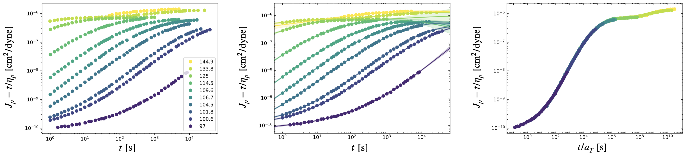

Time-Temperature Superposition
==============================

This demo uses creep compliance data digitized from `Plazek (1965) <https://pubs.acs.org/doi/10.1021/j100894a039>`_.
The data is pre-processed to account for changes in compliance scale, so only horizontal shifting by a scale
factor is required to superpose the data sets taken at different temperatures.

Import Packages
---------------

We'll need a few auxillary packages to run this demo:

.. code-block:: python

   import numpy as np
   import matplotlib.pyplot as plt
   import matplotlib.ticker as tck
   import csv

We can either import the ``mastercurve`` package directly, or we can import only the modules that we need. Doing the latter is a bit cleaner:

.. code-block:: python

   from mastercurves import MasterCurve
   from mastercurves.transforms import Multiply

Loading the Data
----------------

Not all of the data sets contain the same number of points, so we'll process the file using the `CSV <https://docs.python.org/3/library/csv.html>`_ package.

.. code-block:: python

   T = [97, 100.6, 101.8, 104.5, 106.7, 109.6, 114.5, 125, 133.8, 144.9]
   T.reverse()
   ts = [[] for i in range(len(T))]
   Js = [[] for i in range(len(T))]
   with open("data/tts_plazek.csv") as file:
       reader = csv.reader(file)
       next(reader)
       next(reader)
       for row in reader:
           for k in range(len(T)):
               if not row[2*k] == "":
                   ts[k] += [float(row[2*k])]
                   Js[k] += [float(row[2*k+1])]

As is typical during the creation of master curves, it will be easiest to shift the logarithm of the data.
We'll take the logarithm of both the time and compliance coordinates before adding the data to the master curve.

.. code-block:: python

   for k in range(len(T)):
       ts[k] = np.log(np.array(ts[k]))
       Js[k] = np.log(np.array(Js[k]))

Creating the Master Curve
-------------------------

Once the data is pre-processed, only a few steps are needed to create a master curve. First, initialize a
``MasterCurve`` object:

.. code-block:: python

   mc = MasterCurve()

Next, add the data and the horizontal, multiplicative transform to the master curve:

.. code-block:: python

   mc.add_data(ts, Js, T)
   mc.add_htransform(Multiply(scale="log"))

Note that we have passed the argument :attr:`scale="log"` to the ``Multiply()`` constructor, because
the data added to the ``MasterCurve`` object (i.e. :attr:`ts` and :attr:`Js`) is the logarithm of the
measured variables. :attr:`scale="log"` is the default for a ``Multiply()`` object, but we've shown it
explicitly declared here for clarity.

We're now ready to superpose the data!

.. code-block:: python

   mc.superpose()

Plotting the Results
--------------------

Plotting the master curve is also simple. Now that we've superposed the data, let's first change
the reference state to that defined in `Plazek (1965) <https://pubs.acs.org/doi/10.1021/j100894a039>`_:

.. code-block:: python

   mc.change_ref(100, a_ref=10**(1.13)*a[-1])

Now, we can plot the raw data, GP models, and master curve:

.. code-block:: python

   fig1, ax1, fig2, ax2, fig3, ax3 = mc.plot(log=True, colormap=plt.cm.viridis_r)

Lastly, let's clean up the plots a little:

.. code-block:: python

   ax2.tick_params(which="both",direction="in",right=True,top=True)
   ax3.tick_params(which="both",direction="in",right=True,top=True)
   ax3.xaxis.set_major_locator(tck.LogLocator(base=10.0, numticks=14))
   ax3.xaxis.set_minor_locator(tck.LogLocator(base=10.0, subs=[0.1,0.2,0.3,0.4,0.5,0.6,0.7,0.8,0.9,1],numticks=14))
   ax3.set_xticklabels(["", "", "", r"$10^{0}$", "", r"$10^{2}$", "", r"$10^{4}$", "", r"$10^{6}$", "", r"$10^{8}$", "", r"$10^{10}$"])
   plt.show()

The results are shown below!

Retrieving the Shift Factors
----------------------------

Retrieving the shift factors (in this case, the horizontal shift factors :math:`a`) is also straightforward.
Since there is only one transformation parameter, we obtain the values as follows:

.. code-block:: python

   a = mc.hparams[0]

